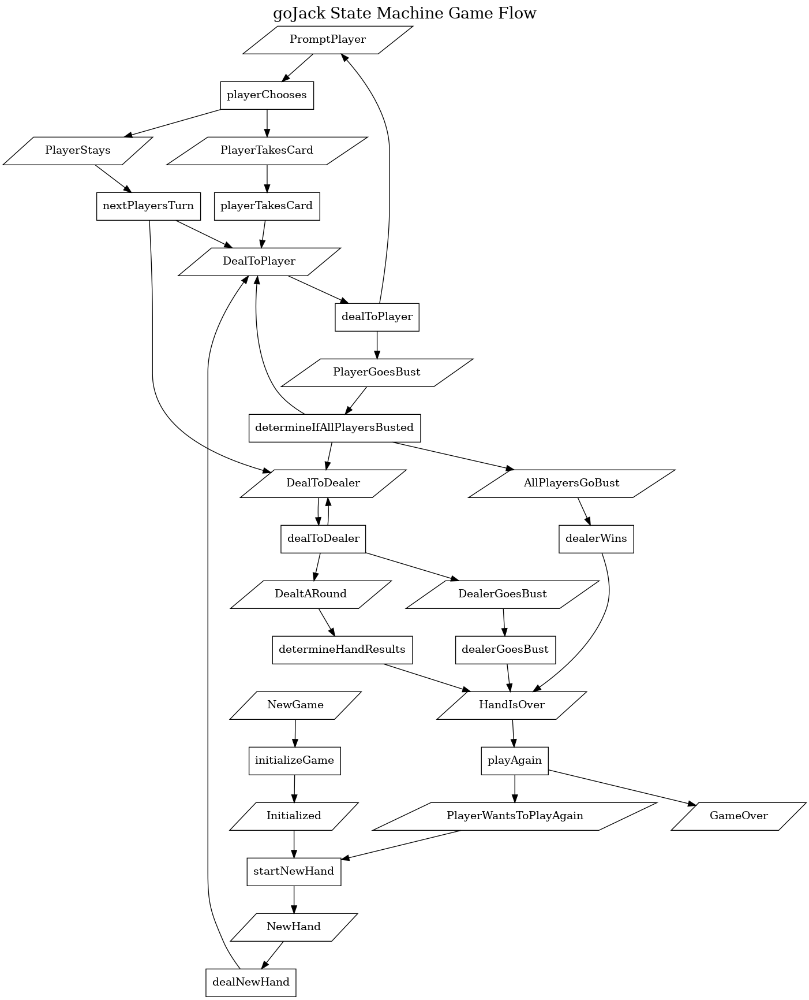

# goJack #

```bash
                                                    JJJJJJJJJJJ          AAA                  CCCCCCCCCCCCCKKKKKKKKK    KKKKKKK
                                                    J:::::::::J         A:::A              CCC::::::::::::CK:::::::K    K:::::K
                                                    J:::::::::J        A:::::A           CC:::::::::::::::CK:::::::K    K:::::K
                                                    JJ:::::::JJ       A:::::::A         C:::::CCCCCCCC::::CK:::::::K   K::::::K
   ggggggggg   ggggg   ooooooooooo                    J:::::J        A:::::::::A       C:::::C       CCCCCCKK::::::K  K:::::KKK
  g:::::::::ggg::::g oo:::::::::::oo                  J:::::J       A:::::A:::::A     C:::::C                K:::::K K:::::K
 g:::::::::::::::::go:::::::::::::::o                 J:::::J      A:::::A A:::::A    C:::::C                K::::::K:::::K
g::::::ggggg::::::ggo:::::ooooo:::::o                 J:::::j     A:::::A   A:::::A   C:::::C                K:::::::::::K
g:::::g     g:::::g o::::o     o::::o                 J:::::J    A:::::A     A:::::A  C:::::C                K:::::::::::K
g:::::g     g:::::g o::::o     o::::o     JJJJJJJ     J:::::J   A:::::AAAAAAAAA:::::A C:::::C                K::::::K:::::K
g:::::g     g:::::g o::::o     o::::o     J:::::J     J:::::J  A:::::::::::::::::::::AC:::::C                K:::::K K:::::K
g::::::g    g:::::g o::::o     o::::o     J::::::J   J::::::J A:::::AAAAAAAAAAAAA:::::AC:::::C       CCCCCCKK::::::K  K:::::KKK
g:::::::ggggg:::::g o:::::ooooo:::::o     J:::::::JJJ:::::::JA:::::A             A:::::AC:::::CCCCCCCC::::CK:::::::K   K::::::K
 g::::::::::::::::g o:::::::::::::::o      JJ:::::::::::::JJA:::::A               A:::::ACC:::::::::::::::CK:::::::K    K:::::K
  gg::::::::::::::g  oo:::::::::::oo         JJ:::::::::JJ A:::::A                 A:::::A CCC::::::::::::CK:::::::K    K:::::K
    gggggggg::::::g    ooooooooooo             JJJJJJJJJ  AAAAAAA                   AAAAAAA   CCCCCCCCCCCCCKKKKKKKKK    KKKKKKK
            g:::::g
gggggg      g:::::g
g:::::gg   gg:::::g
 g::::::ggg:::::::g
  gg:::::::::::::g
    ggg::::::ggg
       gggggg

```

Copyright (c) Matthew Peters, 2023

Additional Copyrights and Credits:

_Tittle art generated at [https://patorjk.com/software/taag](https://patorjk.com/software/taag)_
_using font_
doh.flf _by Curtis Wanner (mailto://cwanner@acs.bu.edu)  (latest revision - 4/95)_

_All copyrights for patorjk.com and Curtis Wanner are held by respective authors or agents._

## Building goJack ##

GoJack is written in _Go version go1.21.0_ and runs as a command-line application.

From the project directory, you can build goJack locally with

```bash
go build -o ./ ./...
```

## Playing goJack ##

goJack is the classic game of Black Jack or Twenty-One.  The game consists of two players: a computerized dealer and yourself.

The game starts with the dealer shuffling a virtual standard 52 card poker deck -- Hearts, Diamonds, Clubs, Spades with values from 2-10, Jack (J), Queen (Q), King (K) and Ace (A).  Number cards are worth the numbers shown.  Face cards (J, Q, K) are worth 10.  Aces are worth either 1 or 11.

The dealer deals two cards to itself and the player.  If a either player has 21 points, the player wins, with ties reverting to the dealer.  If either player has more than 21 points, the player "Goes Bust" and loses the hand.  If neither player receives 21 points in the initial deal, the game goes into rounds, where each player choses to "Hit" and receive a single card, or "Stay" and retain their hand until all players have chosen to stay, have won, or have gone bust.  Once a player choses to "Stay", rounds continue for remaining players, but the player no longer receives cards.  The dealer will continue to hit until the dealer hand has 21, goes bust, or shows 17 or more.  At the end of rounds, the player with the most points wins, with ties reverting to the dealer.

the game moves to rounds a hand, and neither player goes bust, the player with the highest score wins.  If neither player wins with the two initial cards,

Suites do not affect a hand's points.

The winner of each hand is given a point, and scores are shown at the end of each hand.

## Programmer Notes ##

goJack is intended to demonstrate the use of Go and Go Modules and Behavioral Driven Development (BDD) using the Go Cucumber library "Godog."

Tests may periodically break as improvements are added to the game, such as for string representation of cards.  Each of the packages (./pkg/*) are testable using the godog command line from their respective directories.  Broken tests will be corrected when resources are available.

Packages are intended to illustrate compartmentalization of game components.

While Go does not explicitly support Object Oriented Prgramming (OOP) or class inheritence, it does support compositability, allowing for inheritence through inclusion.  Please refer to Go documentation for additional thoughts on this.

### Contributing, Forking, &c ###

Please contact me if you are interested in contributing to goJack.  GoJack is copyrighted content, although it is free to download and build, and play for individual entertainment purposes.  It may not be distributed in code or compiled form for monitary gain unless explicitly under license approved by author.  All rights are reserved, primarily because the content is ultimately intended for use as reference material in upcoming publication efforts.  Forking the repository is forbidden without express written permission from the author.  Portions or all of this repository may be released under license by the author at the author's discretion without notice in the form of other repositories.  Please contact author with any related questions.

## Contact Information ##

Author: Matthew Peters

email: [matthew@datadelve.net](mailto://matthew@datadelve.net)

## Design Discussion Points ##

### Card ###

Each card is represented by a card instance, generated with each new Deck.  The card has a Suite and a Face Value.  Aces are a special Face Value in that they may have two values (1 or 11).  As such, they introduce a logical branch in potential hand values.  The order a card is received into a hand matters, so each card has been given a Value Path, which is a map of each of its face values as keys and a pointer to the next card received in the hand.

Cards are stringified as three character strings, consisting of a unicode representation of their suite, an optional white space for padding, and their number or face (J, K, Q, A).

This is validated through BDD tests, and contributes to the rendering of a player's hand.

### Hand ###

A hand consists of a collection of cards.  A Deck is a special version of a hand.  Each player has a hand.  The dealer also has a deck.

Hands may produce more than one possible value -- a soft and hard value.  A hard value is one with no Aces or where Aces are counted as 11.  A soft value is one that includes Aces scored as 1.

Aces, therefore, represent a branching in possible scoring, introducing a scoring path that considers the Ace as 1 or another where it scores as 11.

Hands also have a preferred order for card presentation - that is, cards are displayed as they are dealt.

I have opted to use a slice of card pointers to represent the cards taken into a hand.
However, as a means of scoring, goJack somewhat simulates the recursive tree traversal algorithm for
weighted and directed graphs.

A hand has four key functions: taking a card, giving a card, scoring the hand, and representing the hand (printing it to the screen).

#### Taking a Card ####

The "Takes" function for the hand receives a card pointer as input. It is then appended to the hand's slice of cards.  The score is
updated.

#### Giving A Card ####

Giving a card is a three step process.  First, the calling function has to pick a card -- that is, it must indicate which card it wants by number. The calling function passes the chosen card number "n" to the GiveCard function, and the second step is for the function selects the card from
the hand's slice.  The slice is then recreated without this card and the card is returned.  As this is strictly used for shuffling and dealing, the score is not recomputed.

#### Scoring a Hand ####

Each hand's scoring can be represented as a directed and weighted tree graph, with the first card received as the root, subsequent cards as nodes, and the last card received by a hand is a leaf in the tree with no outgoing edges - or rather, it has weights, but no subsequent node to link to.  The weight of each edge is one of the card's face values (Aces being the only card with multiple values).  Scoring the hand is a matter of traversing each of the graph's paths from root to leaf.  Paths that exceed 21 are rejected.  The result of this graph traversal is a slice of zero, one, or more values.  A result with no values represents a hand that has gone bust. Finally, the collection of values is evaluated for a minimum value and a maximum value.  These may be the same if no Aces are present in the hand.  The minimum score represents the hand's "Soft Score" and the maximum score represents the "Hard Score".

As a special edge case, the dealer's first card is dealt face-down so nobody knows what the dealer's actual hand is worth.  The scoring process skips any cards where FaceDown is true.  At the end of the game, the dealer's first card has FaceDown set to false, and the score is re-calculated to determine the winner.

##### Example One #####

In this example, the hand has received the following cards: a Two, an Ace, another Ace, and a Queen.  The graph is shown below:

```bash
                2
                ↓
               [2]
                ↓
                A
            ↓       ↓
            [1]    [11]
            ↓       ↓
                A
            ↓       ↓
           [1]     [11]
            ↓       ↓
                Q
                ↓
               [10]
                ↓
               NIL
```

Possible traversals are:

|  PATH                           | VALUE           |
| ----                            | ----            |
| 2 →[2]→A→[1]→A→[1]→Q→[10]→nil   | 14              |
| 2 →[2]→A→[11]→A→[1]→Q→[10]→nil  | 24 (Goes Bust)  |
| 2 →[2]→A→[1]→A→[11]→Q→[10]→nil  | 24 (Goes Bust)  |
| 2 →[2]→A→[11]→A→[11]→Q→[10]→nil | 34 (Goes Bust)  |

The resulting score is a soft 14.

##### Example 2 ######

It is possible to win right out of the gate with the first two cards dealt.  Consider a player that receives a Jack and then an Ace.

```bash
                J
                ↓
               [10]
                ↓
                A
            ↓       ↓
            [1]    [11]
            ↓       ↓
               NIL
```

Possible traversals are:

|  PATH              | VALUE     |
| ----               | ----      |
| J →[10]→A→[1]→nil  |  11       |
| J →[2]→A→[11]→nil  |  21 (Win) |

The resulting score is a soft 11 and a hard 21.

In the code, the tree traversal determining possible values is the domain of the hand package, including the pruning of any paths that exceed a value of 21.  The choice of hard and soft (min and max) traversals is left to the game package.

### Drawing the Hand ###

Drawing the hand involves representing the hand as a string.  This is done by iterating the slice of cards and drawing of each card side by side as terminal ("ascii") art.  It is not true ascii art because terminals have become unicode-capable, but that is not a critical point of discussion.  The String() function is used to return a string that will render the hand when printed to the screen.  This allows some encapsulation in the interest of prepending the player's name when the hand is rendered in the game package.

A dealer's hand will start with the first card face-down, and will render something like this:

```go
Hand:
  ┌───────┒  ┌───────┒
  │ ╬╬╬╬╬ ┃  │♦ 3    ┃
  │ ╬╬╬╬╬ ┃  │       ┃
  │ ╬╬╬╬╬ ┃  │       ┃
  │ ╬╬╬╬╬ ┃  │    ♦ 3┃
  ┕━━━━━━━┛  ┕━━━━━━━┛
```

The player's hand will start with both cards showing (to the player, the dealer does not peek!) and looks something like this:

```go
Hand:
  ┌───────┒  ┌───────┒
  │♠ 3    ┃  │♦ K    ┃
  │       ┃  │       ┃
  │       ┃  │       ┃
  │    ♠ 3┃  │    ♦ K┃
  ┕━━━━━━━┛  ┕━━━━━━━┛
```

## Deck ##

The deck is a structure that is composed of a hand.  When a new deck is created, cards are dealt to its hand in order by descending suit and then descending face value.  Suit order is stricty by poker convention, and has no point value in the game.

The deck has one key functionality, shuffling the deck.

### Shuffling the Deck ###

The one thing that makes a deck different from a hand is that it has the need to be shuffled.  I have chosen to implement suffling as dealing from one hand to another through picking a random card between the first and last remaining in the deck.  The new hand becomes the hand within the shuffled deck.  In this way, the logic of composite design makes more sense than inherited class design.

To implement the shuffle, we loop 52 times, using a decrementing variable which represents the number of cards remaining.  A random integer is selected between 0 and the the remaining number of cards (excluding the number of cards), and we add 1 to the random number.  This allows us to select the top card (1) and the bottom card (initially 52).  We use the hand's "GiveCard" to accomplish this.

On the last iteration, the random function (rand.Intn) cannot chose between 0 and 0, so we simply skip generating a random number and give the remaining top card.

## Player ##

## Dealer ##

## Game ##

### Monolith vs State Machine and Agility ###

In the earliest commits, the game package was written fairly monolithicly, although my intent was always to handle the game with a state machine to determine game flow.  Honestly, this was because I wanted to prototype quickly so I could start playing the game with my kids!  As a result, most of the game flow logic was present, we were able to test interactively, and got some profit in the form of play.  But the code was ugly, with convoluted state conditions that resulted in buggy play.  There was also no way to really test the game with any form of automated BDD - at least without building some form of gimble to interact with the game, and that is not my idea of fun!

Refactoring did not take very long.  As of this commit, there are GameStates and Choice structures in pkg/game/game_states.go.  Choices are completely unused, and I have not gone through the states with a fine-tooth-comb to ensure that they are all used or not.  This is a by-product of refactoring: I started by making an enumerated list of decision points that I believed were in the code, and began compartmentalizing the code into small functions (which you can visualize as nodes) and linked them with the GameStates (you can think of these as edges).  I documented each state function with triggering and resulting states, which works nicely in Visual Studio Code if you mouse-over a state function in the GameStateMachine instantiation:


At this point in the commit history, I have not begun writting BDD tests for the game, but that can me accomplished now through the use of game state and object manipulation for setting up game Givens, selecting a function from the state table, and verifying the resulting changes.

I see this as being aligned with Agile practices - as the code evolved, at each step I focussed on the value that I needed at the time: at first, it was quick-and-dirty but I chould share it with my customers and get the feedback needed for evolving the project.  Next, the predictability and stability of the application was the desired deliverable value.  Finally, the addition of test automation will provide longer-term stability value.  At no point along the way would I consider the code ready for a release.  I don't think targetting a release per sprint is a realistic universal business objective.  But focusing on the established value that is being returned is universally beneficial.  Teams that focus on value begin to talk in terms of value delivered.  They begin to appreciate their worth, and can use that focus to drive velocity.

I would like to point out that the `game.Play(...string)` function is only 7 lines long, after refactoring for the use of the statemachine - and it only does three things:

1. Assign the list of players to the game object
2. Loop until the game state is GameOver
3. Invoke the method from the state machine table that corresponds to the current game state.

By using the state machine pattern, the code is well-organized and easy to read.

### State Functions, Documentation, and Debugging ###

By using consistent documentation for state functions, it is possible to generate visualization of application flow with a couple of simple scripts.
 By executing `graph-game` you can generate an image of game showing states and state functions as a directed graph.

#### graph-game ####

The `graph-game` script will build a docker container with GraphViz installed.  It will then run the docker container, mount the project directory to it, and run the `diagram-game-flow` script from within the container.  This script will produce two files: `states.dot` and   `images/game-states.png`, which looks like this:



I used this visualization to identify errors in the documentation and errors in the state functions: disconnected states or state functions ought not exist, and when they show up, it is usually pretty easy to identify where the bug is.  I used rectangles to reflect state functions, and parallelagrams (commonly used for input and output in flow diagrams) to represent triggering and resulting states. The oval pops up from as a result of `DealARound` state's position in the `states.dot` file, and could be fixed with additional effort in the BASH script.

The only convention needed is to ensure that the comments are consistent: `Trigger States:` and `Resulting States:` appear just before the function declaration and in the same order.  The scripts can be written in BASH, Python, JavaScript, Go, or any language you like.  The `.dot` file convention is actually pretty forgiving about duplicated entries.  I like using BASH for these scripts because BASH is the `de facto lingua-franca` for Linux-based DevOps teams - it shows no favorites, and also has some pretty amazing scripting tools to leverage!

## The gojack Command ##

I have learned over time that the entry-point to an application is not necessarily the place to start writing code.  After years of refactoring and watching code move from module `./cmd` to `./pkg` or `./internal`, I found that putting off the "hello world" element of a project can encourage the use of TDD.  If we want to start realizing value, why not start with creating the parts of an application that are most likely to be reusable?  By doing this, the command file ends up with no more than 12 lines of code, six of which are white-space, imports and package header!  The command is nothing more than a list of game function calls - each of which can be tested thoroughly on their own.  This creates a nice clean line for white- and black-box testing, which sometimes aligns with organizational team structures.
